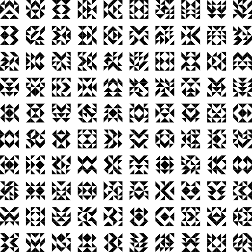

# Haskell-art

To learn and practice Haskell, I used the [diagrams
library](http://projects.haskell.org/diagrams/) to make some nice mathematical
plottings. 

Installation is done using stack :

    stack setup
    stack build
    stack exec hexVariation -- -o out.svg 300

## Hex variation

This is a transcription in Haskell of "Hex Variation" by William Kolmyjec. 
The algorithm itself is inspired from the version by Steve Berrick in the
[Recode project](http://recodeproject.com/artwork/v3n4hex-variation).

## Diamond theory

This is a transcription in Haskell of ["Diamond Theory" by William Kolmyjec](http://recodeproject.com/artwork/v2n1diamond-theory).

## Declaration of Human RightsDiamond theory

This is a transcription in Haskell of ["Universel Declaration of Human Rights" by Kenneth Knowlton](http://recodeproject.com/artwork/v1n2universal-declaration-of-human-rights).

